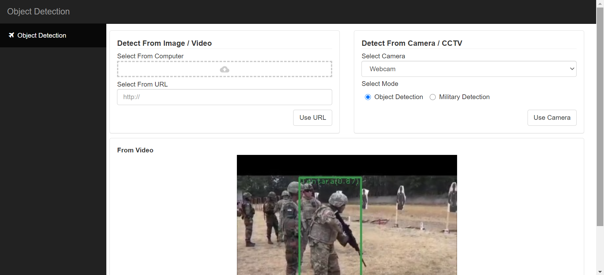

# Military Object Detection

This is a simple object detection application, which can be used to detect military objects, this app is built with the Flask framework, the Python programming language, and uses the Yolo object detection model.

This application is part of the research of the [Algorithm and Computing Research Lab](https://dcse.fmipa.ugm.ac.id/site/en/algorithm-and-computation-research-lab/), developed under the guidance of [Mr. Wahyono, S. Kom., Ph.D.](https://dcse.fmipa.ugm.ac.id/site/en/wahyono-s-kom/).

## Preview



## Installing Setup
Following this step to run the app :

- Clone this repo
- Create a virtual environment inside the folder
- Activate the virtual environment
- Installing all requirements library using this command 
  ```
  pip install -r requirements.txt
  ```
- And App is ready to running, hit this command
  ```
  flask run
  ```

## Libraries
Some of the main libraries that are used in this application :

- [Flask](https://flask.palletsprojects.com/)
- [Bootstrap](https://getbootstrap.com/)
- [Yolo](https://github.com/AlexeyAB/darknet/)
- [OpenCV Python](https://github.com/skvark/opencv-python)